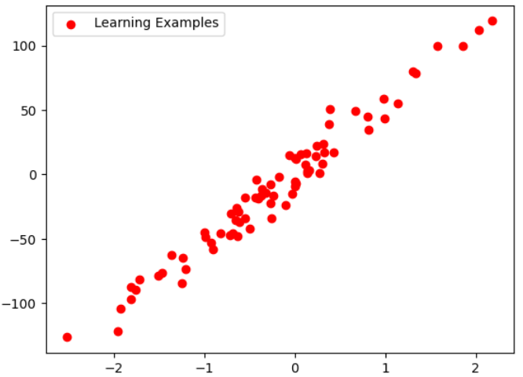
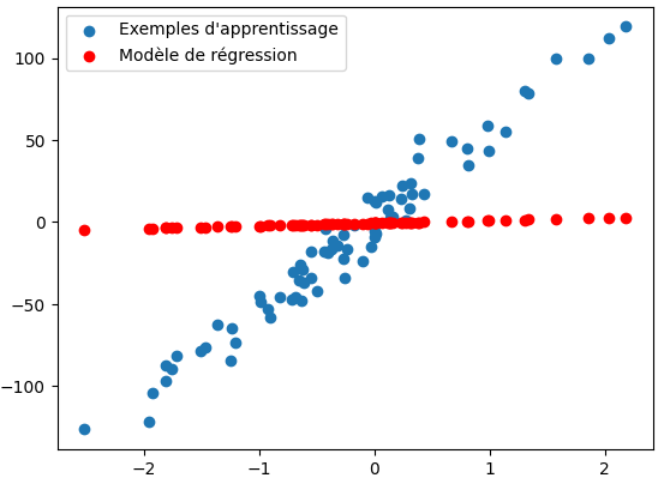
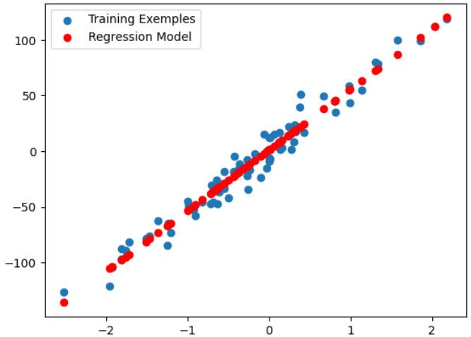
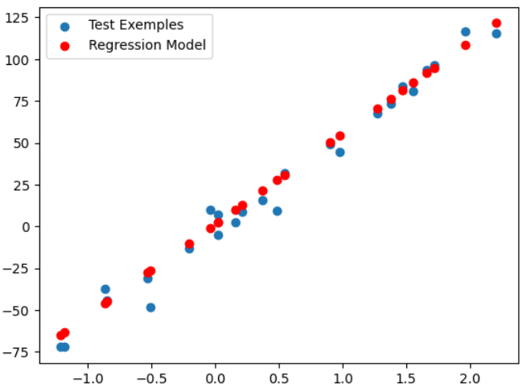
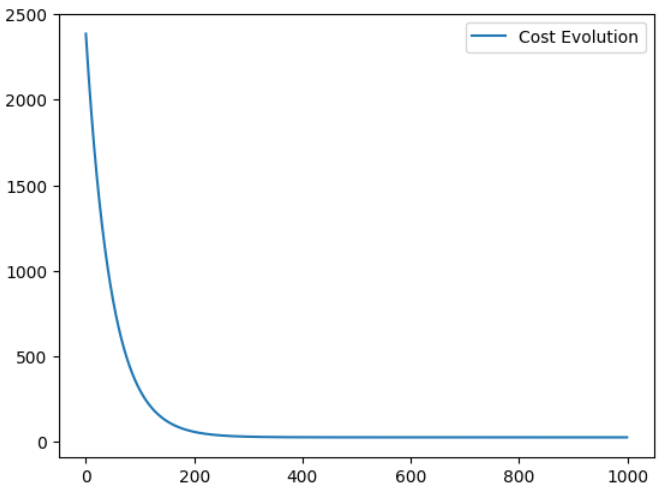

# Regression Modeling with scikit-learn

Welcome to our regression modeling project! In this repository, we explore the implementation of a regression model using scikit-learn in a Jupyter Notebook. This project is structured to guide you through the entire process, from data generation to model evaluation.

## Workflow Overview

### 1. Load Libraries
We begin by importing essential Python libraries for data manipulation, visualization, and machine learning.

```python
# Example code for loading libraries
import numpy as np
from sklearn.datasets import make_regression
import matplotlib.pyplot as plt
```
### 2. Making Random Samples:

We proceed to create synthetic data for our regression analysis. This involves generating random samples, mimicking the characteristics of our real-world data. It's crucial to split this data into training and testing sets to assess our model's generalization performance.

```python
n_observations=100
x,y=make_regression(n_samples=n_observations,n_features=1, noise=10)
y=y.reshape(n_observations,1)
print(np.shape(x))
print(y.shape)
```
(100, 1)
(100, 1)
```python
from sklearn.model_selection import train_test_split
x_train, x_test,y_train,y_test=train_test_split(x,y,test_size=0.25)
plt.scatter(x_train,y_train, c='r',label="Learning Examples")
plt.legend()
```

# X Reshape and Random Beta Vars:

We preprocess our input data, which may involve reshaping it for compatibility with the regression model. We also randomly generate beta variables, representing the coefficients of our regression model. These beta values play a crucial role in determining the relationship between input features and the target variable.
```python
n=np.shape(x_train)[0]
ns=np.shape(x_test)[0]
ones=np.ones((n,1))
tones=np.ones((ns,1))
xTr=np.hstack((x_train,ones)) # [X] -> [X 1]
xTs=np.hstack((x_test,tones)) # [X] -> [X 1]
beta=np.random.randn(2,1) # a and b
print(xTr.shape)
print(beta.shape)
```
Training matrix dimensions(75,2)<br>
Beta matrix dimensions(2,1)

# Model Definition and Test:

We define our regression model. This could be a simple linear regression model or a more complex one, depending on our problem. After defining the model, we conduct a preliminary test to ensure it's functioning as expected.

## The model
```python
def model(X,beta):
    return X.dot(beta)
```
```python
y_pred = model(xTr,beta)
plt.scatter(x_train,y_train,label="Exemples d'apprentissage")
plt.scatter(x_train,y_pred,c='r',label="Modèle de régression")
plt.legend()
```

# Cost, Gradient, and Descent Gradient Definition:

We establish the mathematical framework for training our model. We define the cost function, which quantifies the difference between predicted and actual values. Additionally, we set up the gradient and gradient descent functions to iteratively update the model parameters in the direction that minimizes the cost.
 ## Cost Function [Without Matrix Representation]
 ```python
 def cost_function_(X,beta,y):# Mean squared error function
    n=len(y)
    return (2/n)* np.sum((model(X, beta) - y)**2)
 ```
  ## Cost Function [With Matrix Representation]
 ```python
def cost_function(X,y,beta): # Mean squared error function
    n=len(y)
    u=X.dot(beta)-y
    return (1/(2 * n))*u.T.dot(u)
	
 ```
 ## Gradient
 ```python
 def gradient(X,beta,y):
    n=len(y)
    u=X.T
    v=model(X,beta)-y
    return (2/n)*u.dot(v)
 ```
 ## Gradient Descent
 ```python
 def descente_gradient(X,beta,y,learning_rate=0.01, n_iterations=1000):
    cost=np.zeros(n_iterations)
    for i in range(n_iterations):
        beta=beta-learning_rate*gradient(X,beta,y)
        cost[i]=(cost_function(X,y,beta)[0])
    return beta,cost
 ```
 # Training the Model and Plotting the Result:

We enter the training phase. Utilizing our training data, we adjust the model parameters through iterations of the gradient descent algorithm. After training, we visualize the results by plotting the regression line against the actual data points. This step helps us assess how well our model captures the underlying patterns in the data.
```python
n_iter = 1000
beta_estimer,cost=descente_gradient(xTr,beta,y_train ,learning_rate=0.01, n_iterations=n_iter) # Training Set
tstbeta,cost=descente_gradient(xTs,beta,y_test ,learning_rate=0.01, n_iterations=n_iter) # Testing Set
print(beta_estimer)
```
## Train set result
```python
y_pred=model(xTr,beta_estimer)
plt.scatter(x_train,y_train,label="Training Exemples")
plt.scatter(x_train,y_pred,c='r',label="Regression Model")
plt.legend()
```

## Test set result
```python
y_tst=model(xTs,beta_estimer)
plt.scatter(x_test,y_test,label="Test Exemples")
plt.scatter(x_test,y_tst,c='r',label="Regression Model")
plt.legend()
```

## Cost Evolution Graph
```python
plt.plot(range(n_iter),cost,label="Cost Evolution")
plt.legend()
```


# Model Evaluation Using R2 Metric:

We evaluate the performance of our trained model using the R2 metric. This metric provides insights into the proportion of variance in the target variable that is explained by our model. A higher R2 value indicates a better fit.
```python
from sklearn.metrics import r2_score
r2 = r2_score(y_test, y_tst)
def ft_r_carre(y, pred):
    a = ((y - pred)**2).sum()
    b = ((y - y.mean())**2).sum()
    return  1 - a / b
print(ft_r_carre(y_test, y_tst))
print(r2_score(y_test, y_tst))
```
0.9796368584212931<br>
0.9796368584212931